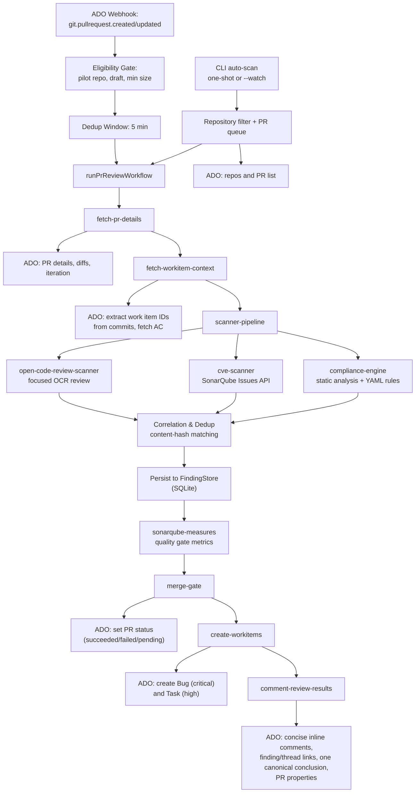

# Runtime Architecture

## Component View (v2 — PR Guardian Copilot)

## Startup Flow

The CLI loads a `ConfigProvider` (which resolves `config.openCodeReview.llm`, global
tuning values like `openCodeReview.concurrency`, compliance thresholds, workspace
buffer sizes, and sensitive-data-mask patterns from `.ratan/config.json`), connects
to ADO, and registers a queue processor. `start --pr-id` calls
`startReviewPrWithProvider` directly so errors and completion propagate to the shell.
One-shot and watch scans use `AutoScanService` to filter repositories, enqueue
eligible PRs, and apply the build-status gate at dequeue time. `--repo-pattern`
overrides configured globs. Watch mode uses the configured OCR URL and credential
for its reachability check and runs the feedback daemon alongside the scan interval.

Each explicit review registers the provider session, creates a small
`RequestContext` containing only `configSessionId`, then runs sequential workflow
steps. Step boundaries validate Zod input/output schemas; workflow data is passed
directly rather than stored in a registry or step-result context map.

## PR Scan Flow

`AutoScanService.scan`:

1. Reads `scanRepoNames` and `scanPRCreatedDaysAgo` from root config.
2. Gets repositories from the ADO client (cached for 24 hours via module-level cache).
3. Applies repository name glob patterns through `minimatch`.
4. Fetches active PRs created within the configured time window.
5. Skips PRs without ids.
6. Uses `adoClient.isValidPullRequest`.
7. Fetches PR details with comments.
8. Skips PRs where the agent has already commented.
9. Enqueues `{ repoName, repoId, prId }`.

## Scanner Pipeline Flow

The scanner pipeline runs all scanners concurrently via `Promise.allSettled`:

1. **OpenCodeReview Scanner**: Select deterministic focuses from changed files, run OpenCodeReview once with PR/work-item context and native OCR rules, then map comments to `NormalizedFinding` objects. OpenCodeReview owns review semantics; PR Guardian does not rescore or invent confidence.
2. **CVE Scanner**: Queries SonarQube Issues API for `VULNERABILITY` and `SECURITY_HOTSPOT` types → map to `NormalizedFinding`.
3. **Compliance Engine**: Static analysis rules:
   - Pattern scan: TODO/FIXME/HACK/XXX comments
   - console.log / debugger detection
   - Large file detection (configurable threshold)
   - YAML policy-as-code rules (configurable)

All scanner results are collected, correlated by scanner engine, deduplicated by content hash (SHA-256 of `filePath + surrounding code`), and persisted to the `FindingStore` SQLite database. OCR metadata records the selected focuses and their reasons. The correlation summary presents blocking, important, and advisory sections grouped by category with concise finding details; these are display buckets and do not change stored severity or merge-gate inputs.

Fallback dedup: location-based matching `(filePath, lineStart +/- 3, sourceEngine, category)`.

## Merge Gate Flow

After all findings are collected and persisted:

1. Read merge policy from root config (severity/category thresholds).
2. Evaluate blocking findings against policy.
3. Set ADO PR Status via `adoClient.createPullRequestStatus`:
   - `succeeded` — no blocking findings
   - `failed` — blocking findings exist
   - `pending` — review in progress
4. Errors are non-fatal; workflow continues.

## Audit Observability Flow

`record-audit` persists an allowlisted pilot payload in
`audit_records.raw_scanner_outputs`: selected focuses and routing reasons, OCR
status and warning types, duration, reviewed-file count, postable finding count,
duplicate-suppression counts, inline-suppression counts, and review execution
status. Arbitrary scanner metadata and model credentials are not copied. The
existing `/api/audit` endpoint exports the stored payload; the dashboard does
not add focus/status filters until operator consumption justifies them.
Unknown string categories in OCR comments are normalized to `other`. If a
failure escapes the scanner pipeline after workspace routing, the workflow
fallback retains the focuses already selected for that workspace.

## Work Item Creation Flow

1. Collect findings with severity = Critical (→ Bug) or High (→ Task).
2. Skip if work item creation is disabled in config.
3. Create ADO work items via `adoClient.createWorkItem`.
4. Link work items to PR via artifact link.
5. Treat null or missing-ID responses as warnings; errors are non-fatal and the workflow continues.

## Comment Flow

`comment-review-results`:

1. Reads normalized scanner findings and the merge-gate decision.
2. Reads original PR details from the `fetch-pr-details` step result.
3. Reconciles with previous review findings (content-hash matching) for re-review.
4. Marks linked threads Fixed when a complete re-review persisted the linked finding, or a later superseding descendant, as resolved.
5. Refreshes previously linked inline threads with the current compact `priority · severity`, title, explanation, and suggested-fix format.
6. Selects new inline-postable findings with a valid file and positive line, orders by blocking status and severity, suppresses linked or repeated content hashes, then applies the 30-comment cap.
7. Posts one canonical main conclusion after all inline work so it is the newest/top ADO thread. It contains only the merge decision, finding count, compact SonarQube coverage/new-bug/new-vulnerability/new-code-smell results, and reviewed commit; prior agent-generated conclusion threads are then deleted. Inline titles are bounded, escaped Markdown headings and suggested fixes use plain fenced code blocks.
8. Stores the latest reviewed iteration id in PR properties under `CODE_REVIEW_AGENT_LATEST_REVIEW_ID`.
9. Links each created ADO inline thread to its persisted finding in `finding_comment_threads`.
10. Returns `mainCommentId` and `codeCommentIds`.

The feedback daemon uses these associations to apply thread reactions or status changes only to the represented finding; it does not apply every PR thread to every finding.

### Re-review Reconciliation

`reconcileFindings()` compares previous findings (same PR, latest reviewed iteration) vs current findings:
- **findingsToCreate** — truly new (no content hash match)
- **findingsToSupersede** — existing finding with updated details
- **findingsToResolve** — finding that disappeared → auto-close
- **findingsToKeep** — active overrides preserved

After a complete review, these transitions are persisted: disappeared findings
become `resolved`, matches become `superseded`, and all current findings are
upserted. An incomplete review may persist partial current findings but never
resolves or supersedes prior findings. Starting a newer review for the same PR
aborts the prior review's output; stale workflows stop at the next workflow
event before status, audit, work-item, or comment publication.

## Webhook Flow

1. ADO sends `git.pullrequest.created` or `git.pullrequest.updated` event to `POST /webhooks/ado`.
2. HMAC-SHA256 signature validation against configured webhook secret.
3. Extract `resource.repository.id`, `resource.pullRequestId`.
4. Check dedup window (5 min) — skip if recently processed.
5. Check eligibility gate — pilot repo, draft status, min size.
6. Trigger `runPrReviewWorkflow`.

## Data Privacy Flow

Diff text passes through `maskSensitiveData`, which uses `redact-pii` credential redaction plus custom patterns for Stripe-style keys, bearer tokens, and assignments to `password`, `token`, or `secret`.

Before OCR executes, the runner builds an isolated two-commit Git repository for
the requested base/head range and masks changed text there. Replacement markers
use a per-run keyed digest, allowing the review to distinguish changed secrets
without receiving their original values or a reusable cross-run hash. The source
checkout is never modified, and the temporary repository is removed after the
run, including error paths.

The current masking configuration intentionally does not redact email addresses,
names, phone numbers, IP addresses, URLs, generic digits, or street addresses.

## Dashboard Data Flow

The Express API reads SQLite through `FindingStore` query methods. `/api/findings`
supports global and independent PR/repository/engine/resolution filters;
`/api/overrides` exposes override history; stats count unique
`repository + pullRequestId` pairs; and `/api/prs` selects the latest review per
repository-aware PR before computing status and finding counts. The SPA uses
these APIs for findings, PR details, overview charts, override administration,
and pending-queue clearing.
