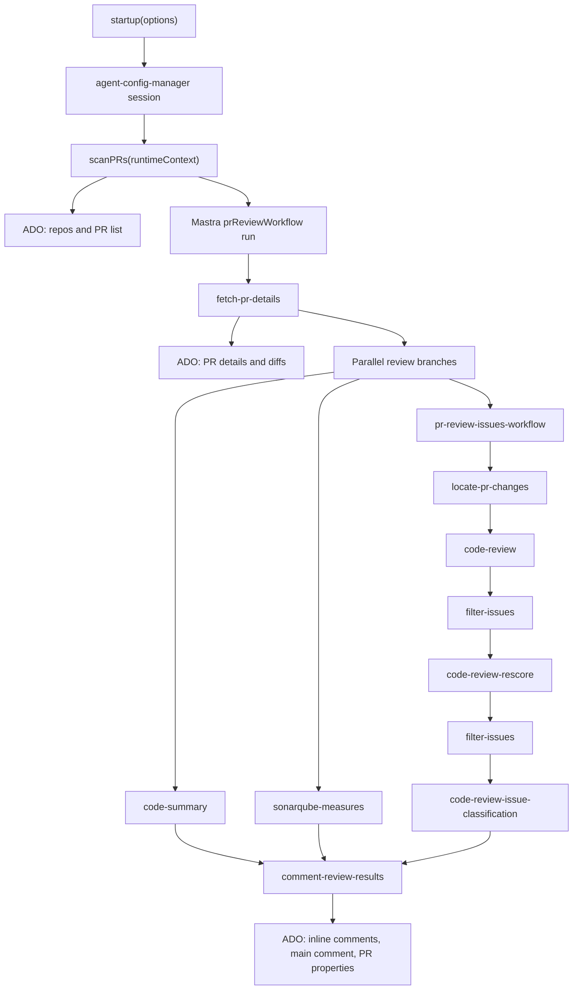

# Runtime Architecture

## Component View



## Startup Flow

`startup(startupOptions)` accepts `AgentConfigCreationOptions`. It creates a config session, then calls `scanPRs` with:

```ts
{
  runtimeContext: {
    configSessionId: agentConfig.id
  }
}
```

`scanPRs` returns an RxJS `Observable` of pending pull requests. For every pending PR, `startup` creates a Mastra workflow run, sets `configSessionId` in `RuntimeContext`, streams the workflow, and logs every full-stream output.

## PR Scan Flow

`scanPRs`:

1. Reads `scanRepoNames` and `scanPRCreatedDaysAgo` from root config.
2. Gets repositories from the ADO client.
3. Applies repository name glob patterns through `minimatch`.
4. Fetches active PRs created within the configured time window.
5. Skips PRs without ids.
6. Uses `adoClient.isValidPullRequest`.
7. Fetches PR details with comments.
8. Skips PRs where the agent has already commented.
9. Emits `{ repoName, prId }`.

## Issue Review Flow

`locate-pr-changes` prepares diffs by:

- masking sensitive data with `maskSensitiveData`
- checking latest PR iteration
- comparing the latest reviewed iteration property
- filtering to changed files since the last review
- applying file allowlist and blocklist patterns
- excluding deleted files

`code-review` loops over `codeDiffsArray`, chunks large diffs by `MAX_CHARACTER`, builds the `review` prompt, calls `codeReviewAgent.generateLegacy`, assigns the file path to returned issues, and sorts them.

`filter-issues` removes issues below confidence `0.8`.

`code-review-rescore` builds the `review-rescore` prompt, asks the rescore agent for new confidence scores by issue index, and applies returned scores.

`code-review-issue-classification` builds the `issue-classification` prompt, asks the classifier for category and sub-category by issue index, and defaults missing values to `Uncategorized`.

## Summary And Sonar Flow

`code-summary` receives the full PR diff string. If it exceeds `MAX_CHARACTER`, it truncates the diff and prepends a warning to the generated summary. Empty diffs return `No code changes detected.`

`sonarqube-measures` asks the configured SonarQube client for PR measures by `pullRequestId` and `repoName`. It returns `null` when no client exists or when fetching measures fails.

## Comment Flow

`comment-review-results`:

1. Reads classified review issues, summary text, and SonarQube measures.
2. Reads original PR details from the `fetch-pr-details` step result.
3. Posts up to 30 inline code comments, in reverse order.
4. Posts the main PR review comment with approval status, errors, summary, and SonarQube measures.
5. Stores the latest reviewed iteration id in PR properties under `CODE_REVIEW_AGENT_LATEST_REVIEW_ID`.
6. Returns `mainCommentId` and `codeCommentIds`.

## Data Privacy Flow

Diff text passes through `maskSensitiveData`, which uses `redact-pii` credential redaction plus custom patterns for Stripe-style keys, bearer tokens, and assignments to `password`, `token`, or `secret`.

The current masking configuration intentionally does not redact email addresses, names, phone numbers, IP addresses, URLs, generic digits, or street addresses.
